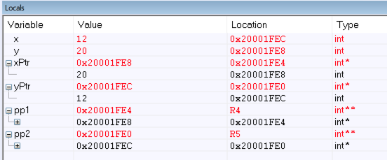

 

1. #### Create a function in “C” that allows swapping of two pointers. 

   ##### a. Explain what the “main” function does in order to setup the input arguments prior to calling the swap_pointer() function? 

   It pushes all values to the stack and moves the addresses stored in the pointers and double pointers to registers

   ##### b. What are the values in R0 & R1 when swap_pointer() is called? 

   The addresses of x and y.

   ##### c. Share a screen shot of the local variables inside of “main” after the function swap_pointer() returns showing the values of the pointers and what they are pointing to.

   